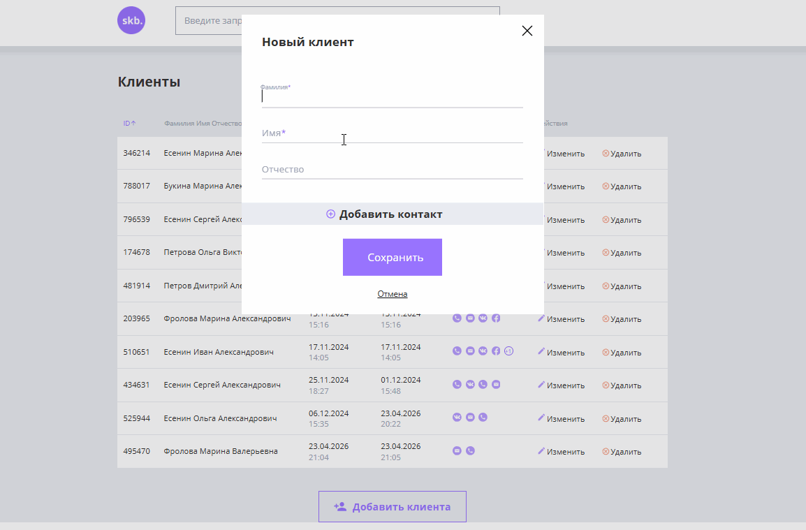
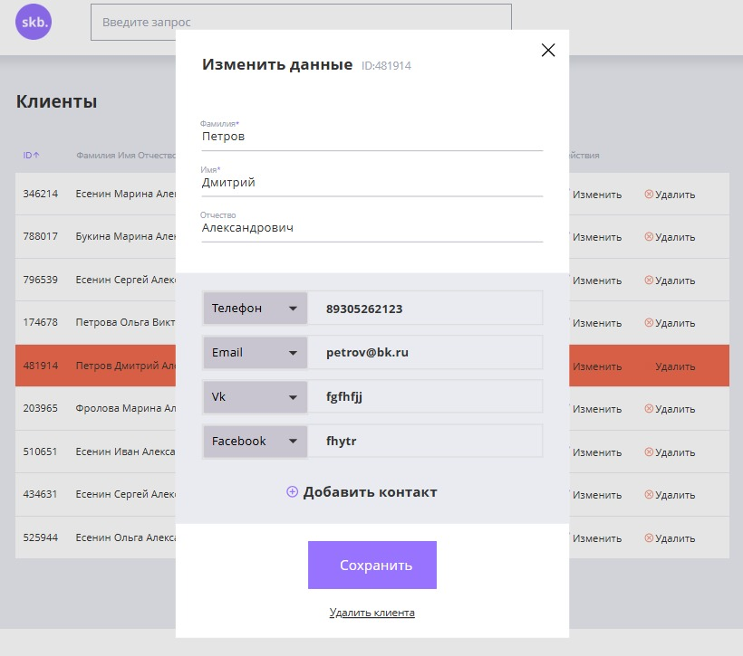
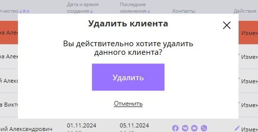
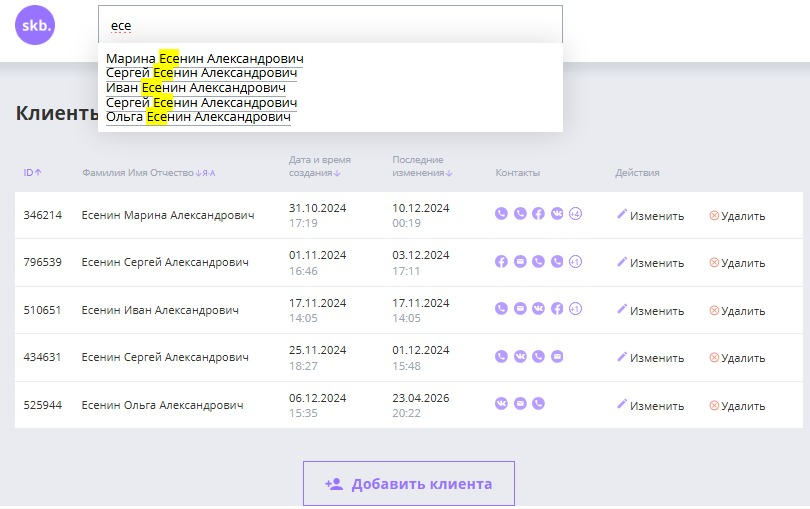

# 🚀 CRM System

<p align="center">
  <b>Client Management App with REST API</b><br/>
  Clean UI • CRUD • Filtering & Sorting • API Integration
</p>

<p align="center">
  <a href="https://github.com/frolovam008-cyber/crm-project">
    
  </a>
  <a href="#">
    
  </a>
  <a href="#">
    
  </a>
  <a href="#">
    
  </a>
</p>

---

## ✨ Overview

A simple but fully functional CRM system for managing clients.  
Demonstrates real-world frontend ↔ backend interaction using REST API.

---

## ⚡ Features

- ➕ Create clients
- ✏️ Update client data
- 🗑 Delete clients
- 🔎 Search, filter & sort
- 📋 Manage contacts
- ⚡ Instant UI updates (no page reload)

---

## 🧠 Tech Stack

<p>
  
  
  
  
  
</p>

---

## 🖼 Preview

### 🚀 Live Demo

<p align="center">
  
</p>

---

### 🧾 Key Screens

<p align="center">
  
  
  
</p>

---

## 🚀 Getting Started

### 1. Backend

```bash
cd crm-backend
npm install
npm start
```

📍 Runs on: http://localhost:3000


### 2. Frontend
```bash
cd crm-frontend
npx serve .
```

📍 Open the URL shown in terminal.

---

## 🔌 API Endpoints

- GET `/api/clients` — Get all clients  
- POST `/api/clients` — Create client  
- PATCH `/api/clients/{id}` — Update client  
- DELETE `/api/clients/{id}` — Delete client  

---

## 🎯 Project Goal

This project was built to practice real-world application development:

- Client-server communication  
- CRUD operations  
- REST API integration  
- Dynamic UI updates without page reload  

---

## 📌 Future Improvements

Possible directions for future development:

- Migration to React / TypeScript for better scalability
- Integration with a database (PostgreSQL or MongoDB)
- Adding authentication (JWT-based login system)
- UI/UX improvements for better user experience


## 👩‍💻 Author

*Marina Frolova*<br>
**Frontend Developer**

<p align="center"> ⭐ If you like this project — give it a star! </p>